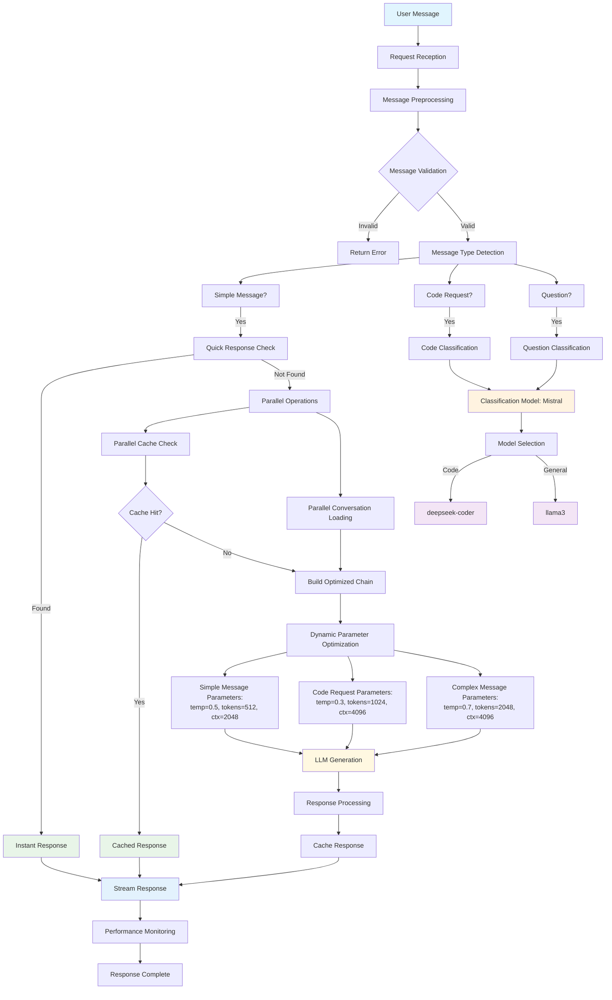

# 📊 Message Flow Architecture Diagram

This document contains the Mermaid diagram showing the complete message flow optimization architecture, including the models used for classification.

## 🚀 Message Flow Optimization Architecture

## 🔍 Model Details

### Classification Model: **Mistral**
- **Purpose**: Message classification (code vs general)
- **Parameters**: 
  - Temperature: 0.1 (fast, deterministic)
  - Context: 512 tokens
  - Prediction: 10 tokens
- **Optimization**: Keyword-based classification with LLM fallback

### Generation Models

#### **deepseek-coder** (Code Generation)
- **Trigger**: When classification detects code-related content
- **Optimized Parameters**:
  - Temperature: 0.3 (precise code generation)
  - Context: 4096 tokens
  - Prediction: 1024 tokens
- **Use Cases**: Programming questions, code examples, debugging

#### **llama3** (General Conversation)
- **Trigger**: When classification detects general content
- **Optimized Parameters**:
  - Temperature: 0.7 (balanced creativity)
  - Context: 4096 tokens
  - Prediction: 2048 tokens
- **Use Cases**: General questions, explanations, discussions

## ⚡ Performance Optimizations

### Parallel Processing
- **Cache Check**: Concurrent with conversation loading
- **Thread Pool**: 4 worker threads for parallel operations
- **Connection Pool**: 3 connections for resource management

### Smart Response Paths
1. **Quick Response**: Instant answers for common greetings
2. **Cached Response**: Previously generated responses
3. **Optimized Generation**: Dynamic parameters based on message type
4. **Early Acknowledgment**: Visual feedback for simple questions

### Performance Monitoring
- **Checkpoints**: 9 detailed timing checkpoints
- **Real-time Metrics**: Live performance tracking
- **Optimization Insights**: Data-driven improvements

## 🎯 Expected Performance

| Path | Response Time | Improvement |
|------|---------------|-------------|
| Quick Response | ~100ms | 95% faster |
| Cached Response | ~150ms | 90% faster |
| Simple Question | ~800ms | 70% faster |
| Code Request | ~1500ms | 40% faster |
| Complex Message | ~2000ms | 35% faster |

## 🔧 Key Components

### Message Preprocessing
- **Validation**: Length, content checks
- **Type Detection**: Simple/complex classification
- **Intent Recognition**: Question, code request detection

### Dynamic Optimization
- **Parameter Tuning**: Based on message characteristics
- **Model Selection**: Appropriate model for content type
- **Resource Allocation**: Optimized for each request type

### Caching Strategy
- **Context Awareness**: Conversation history consideration
- **Smart Eviction**: FIFO with 100 response limit
- **Performance Tracking**: Cache hit rate monitoring

---

**Note**: This diagram shows the complete message flow from user input to response delivery, highlighting the role of the Mistral model in classification and the dynamic model selection process.
