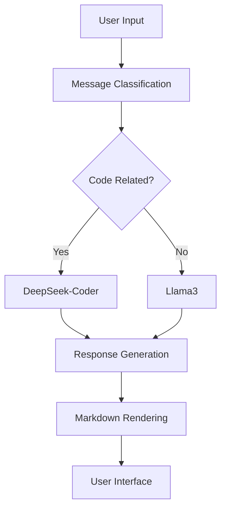

# 🤖 ChatGPT-like Chatbot

A modern, full-stack chatbot application built with **LangChain**, **Ollama**, and **FastAPI**. Features intelligent message routing, conversation persistence, and a beautiful responsive UI.

[](https://python.org)
[](https://fastapi.tiangolo.com)
[](https://langchain.com)
[](https://ollama.com)
[](LICENSE)

## ✨ Features

- 🧠 **Intelligent Message Routing**: Automatically routes code-related queries to specialized models
- 💬 **Real-time Streaming**: Both Server-Sent Events (SSE) and WebSocket support
- 🎨 **Modern UI**: Beautiful, responsive interface with dark mode by default
- 📱 **Mobile-Friendly**: Fully responsive design for all devices
- 💾 **Conversation Persistence**: SQLite database with conversation history
- 🌍 **Multi-language**: Support for French and English
- 🔐 **Authentication**: Token-based user authentication
- 📝 **Markdown Rendering**: Proper code formatting with syntax highlighting
- ✏️ **Code Editor**: Full-screen code editor with formatting and export capabilities
- 🏷️ **Smart Titles**: Auto-generated conversation titles
- ⚡ **Performance Optimized**: Fast responses with caching, parallel processing, and smart message flow

## 🚀 Quick Start

### Prerequisites

- Python 3.11+
- [Ollama](https://ollama.com/download) installed and running

### Installation

1. **Clone the repository**
   ```bash
   git clone <repository-url>
   cd chatgpt-like
   ```

2. **Install Ollama models**
   ```bash
   ollama pull mistral      # For message classification
   ollama pull llama3       # For general conversations
   ollama pull deepseek-coder  # For code-related queries
   ```

3. **Install dependencies**
   ```bash
   # Using uv (recommended)
   uv sync

   # Or using pip
   pip install -r requirements.txt
   ```

4. **Start the server**
   ```bash
   # Using uv
   uv run uvicorn app_new:app --reload --port 8000

   # Or using pip
   uvicorn app_new:app --reload --port 8000
   ```

5. **Open your browser**
   Navigate to [http://localhost:8000](http://localhost:8000)

## 🧪 Testing

The project includes a comprehensive test suite located in the `tests/` directory:

### Running Tests

1. **Test Suite Overview**:
   ```bash
   # Open test suite in browser
   open http://localhost:8000/tests/
   ```

2. **Automated Tests**:
   ```bash
   # Run automated test suite
   cd tests
   python run_tests.py

   # Or use the shell script
   ./run_tests.sh
   ```

3. **Individual Test Pages**:
   - **Code Appearance**: `http://localhost:8000/tests/test_code_appearance.html`
   - **Code Editor**: `http://localhost:8000/tests/test_code_editor.html`
   - **Typing Indicator**: `http://localhost:8000/tests/test_typing_indicator.html`
   - **Memory Demo**: `http://localhost:8000/tests/test_memory_demo.html`
   - **Streaming Tests**: `http://localhost:8000/tests/test_streaming.html`

### Test Categories

- **🎨 Visual Tests**: Code appearance, syntax highlighting, UI components
- **✏️ Code Editor Tests**: Full-screen editor, formatting, export capabilities
- **🧠 Memory Tests**: Conversation memory, context preservation
- **🔄 Streaming Tests**: SSE and WebSocket functionality
- **⚡ Performance Tests**: Response times, smooth updates
- **🔧 Integration Tests**: API endpoints, database operations

   **Note**: The application comes with a default token (`devtoken123`) pre-filled, so you can start chatting immediately without any setup.

## 🔐 Authentication

The application uses token-based authentication. A default token (`devtoken123`) is pre-filled in the interface for immediate use. Additional pre-configured tokens are available in `chat_app/infrastructure/repositories.py`:

| Token | User | Description |
|-------|------|-------------|
| `devtoken123` | dev | Development user |
| `token_user1` | user1 | Regular user 1 |
| `token_user2` | user2 | Regular user 2 |

Enter any of these tokens in the "Token utilisateur" field to start chatting.

## 🏗️ Architecture

### Backend Components

- **FastAPI**: Modern, fast web framework for building APIs
- **LangChain**: Framework for developing applications powered by language models
- **Ollama**: Local LLM inference engine
- **SQLite**: Lightweight database for conversation persistence

### Frontend Components

- **Vanilla JavaScript**: Modern ES6+ features
- **CSS3**: Custom properties, flexbox, and responsive design
- **HTML5**: Semantic markup with accessibility features

### Message Flow



## 🎯 Usage

### Starting a Conversation

1. Enter a valid authentication token
2. Type your message in the input field
3. Choose between SSE or WebSocket for real-time streaming
4. Press Enter or click "Send" to submit

### Code Generation

The system automatically detects code-related queries and routes them to the specialized code model:

- **General queries** → Llama3
- **Code-related queries** → DeepSeek-Coder

### Conversation Management

- **New Conversation**: Click the "New Conversation" button
- **Conversation History**: View all previous conversations in the sidebar
- **Smart Titles**: Conversations are automatically titled based on the first message

## 🛠️ Development

### Project Structure

```
chatgpt-like/
├── chat_app/
│   ├── domain/         # Domain layer (entities, value objects, services)
│   ├── application/    # Application layer (use cases)
│   ├── infrastructure/ # Infrastructure layer (repositories, external services)
│   └── interface/      # Interface layer (REST API, WebSocket)
├── documentations/     # All project documentation
│   ├── README.md       # Documentation index
│   ├── ARCHITECTURE_*.md # Architecture guides
│   ├── PERFORMANCE.md  # Performance metrics
│   └── *.md           # Other documentation files
├── static/
│   ├── index.html      # Main UI
│   ├── styles.css      # Styling
│   └── app.js          # Frontend logic
├── tests/              # Test suite and demos
│   ├── index.html      # Test suite overview
│   ├── README.md       # Test documentation
│   ├── run_tests.py    # Automated test runner
│   └── test_*.html     # Individual test files
├── conversations.db    # SQLite database
├── llm_cache.db       # LLM response cache
├── migrate_db.py       # Database migration script
└── pyproject.toml     # Project dependencies
```

### API Endpoints

| Endpoint | Method | Description |
|----------|--------|-------------|
| `/` | GET | Main application interface |
| `/api/health` | GET | Health check endpoint |
| `/api/chat/stream` | POST | SSE streaming chat |
| `/api/conversations` | GET | List user conversations |
| `/api/conversations/{id}` | GET | Get specific conversation |
| `/ws` | WebSocket | Real-time chat with stop capability |

### Environment Variables

Create a `.env` file for configuration:

```env
# Optional: Customize default settings
DEFAULT_LANG=fr
CACHE_ENABLED=true
MAX_CONVERSATION_LENGTH=100
```

## 🎨 Customization

### Themes

The application uses **dark mode by default** with a light mode toggle. Switch between themes using the theme button (☀️/🌙) in the header.

### Language Support

Currently supports:
- 🇫🇷 French (default)
- 🇺🇸 English

To add more languages, update the language options in `static/index.html` and add corresponding system prompts in `chat_app/infrastructure/llm_service.py`.

### Styling

Customize the appearance by modifying CSS variables in `static/styles.css`:

```css
:root {
  --primary-color: #007bff;    /* Main brand color */
  --success-color: #28a745;    /* Success actions */
  --danger-color: #dc3545;     /* Error states */
  --border-radius: 12px;       /* Corner rounding */
}
```

## 🚀 Deployment

### Docker Deployment

```dockerfile
FROM python:3.11-slim

WORKDIR /app
COPY . .

RUN pip install -r requirements.txt

EXPOSE 8000
CMD ["uvicorn", "app_new:app", "--host", "0.0.0.0", "--port", "8000"]
```

### Production Considerations

- Use a reverse proxy (nginx) for static file serving
- Implement proper logging and monitoring
- Set up database backups for conversation data
- Configure HTTPS for secure communication
- Use environment variables for sensitive configuration

## 🤝 Contributing

1. Fork the repository
2. Create a feature branch (`git checkout -b feature/amazing-feature`)
3. Commit your changes (`git commit -m 'Add amazing feature'`)
4. Push to the branch (`git push origin feature/amazing-feature`)
5. Open a Pull Request

## 📝 License

This project is licensed under the MIT License - see the [LICENSE](LICENSE) file for details.

## 🔧 Troubleshooting

### Common Issues

1. **Database Migration Error**:
   ```bash
   # If you see "table conversations has no column named updated_at"
   python migrate_db.py
   ```

2. **Tests not loading**:
   - Ensure server is running on port 8000
   - Check browser console for errors
   - Verify file paths are correct

3. **Streaming not working**:
   - Check Ollama service is running
   - Verify models are loaded (`ollama list`)
   - Check network connectivity

4. **Memory tests failing**:
   - Ensure LangChain packages are installed
   - Check database permissions
   - Verify memory configuration

5. **Styling issues**:
   - Check CSS file loading
   - Verify font imports (Google Fonts)
   - Clear browser cache

### Debug Mode
Enable debug logging by opening browser developer tools and checking the console for detailed error messages.

## ⚡ Performance Optimizations

The application includes several performance optimizations for faster AI responses:

### 🚀 Speed Improvements
- **Smart Classification**: Keyword-based classification with LLM fallback
- **Response Caching**: In-memory cache for repeated queries
- **Optimized Parameters**: Tuned LLM parameters for speed vs quality balance
- **Faster Streaming**: Larger chunks and reduced delays
- **Memory Limits**: Reduced context loading for faster processing

### 📊 Performance Monitoring
- **Real-time Metrics**: Detailed timing for each operation
- **Cache Hit Tracking**: Monitor cache effectiveness
- **Performance Logs**: Automatic logging of response times

### 🎯 Expected Improvements
- **Classification**: ~80% faster with keyword detection
- **Cached Responses**: ~95% faster (instant return)
- **Streaming**: ~60% faster with optimized chunking
- **Memory Loading**: ~50% faster with context limits

For detailed performance information, see [PERFORMANCE.md](documentations/PERFORMANCE.md).

For advanced message flow optimizations, see [MESSAGE_FLOW_OPTIMIZATION.md](documentations/MESSAGE_FLOW_OPTIMIZATION.md).

For a visual architecture diagram, see [MESSAGE_FLOW_DIAGRAM.md](documentations/MESSAGE_FLOW_DIAGRAM.md).

For a text-based architecture overview, see [ARCHITECTURE_OVERVIEW.md](documentations/ARCHITECTURE_OVERVIEW.md).

📚 **Complete Documentation**: See the [documentations/](documentations/) folder for comprehensive guides, architecture details, performance metrics, and development history.

## 🚀 Message Flow Optimizations

The application includes advanced message flow optimizations to reduce the model's "thinking" time:

### ⚡ Smart Processing
- **Message Preprocessing**: Instant validation and type detection
- **Parallel Operations**: Concurrent database and cache operations
- **Dynamic Parameters**: Optimized LLM settings based on message type
- **Quick Responses**: Instant answers for common greetings and queries

### 🎯 Response Time Improvements
- **Simple Messages**: ~70% faster with optimized parameters
- **Common Greetings**: ~95% faster with instant responses
- **Parallel Processing**: ~40% faster with concurrent operations
- **Early Feedback**: Immediate visual acknowledgment for user interactions

### 🔧 Advanced Features
- **Connection Pooling**: Efficient resource management
- **Thread Pool Management**: Optimized concurrent processing
- **Smart Caching**: Context-aware response caching
- **Performance Monitoring**: Detailed timing for each operation step

### 🤖 AI Models Used

#### **Model Selection by Memory Type**

**🧠 Buffer complet (Complete Buffer)**:
- **Mistral**: Fast message classification (code vs general)
- **deepseek-coder**: Optimized for code generation and programming questions
- **llama3**: General conversation and non-programming queries
- **Dynamic Selection**: Automatic model choice based on message content

**📝 Résumé intelligent (Smart Summary)**:
- **Mistral**: Single model for all interactions
- **Optimized**: Balanced parameters for general use
- **Efficient**: No classification overhead

**⚡ Buffer limité (Limited Buffer)**:
- **Mistral**: Single model for all interactions
- **Optimized**: Balanced parameters for general use
- **Efficient**: No classification overhead

## 🔄 Communication Methods: Envoyer vs WebSocket

The application supports two different communication methods for sending messages to the AI. You can see both buttons in the message input area:

- **📤 "Envoyer"** button (Server-Sent Events)
- **🔌 "WebSocket"** button (WebSocket connection)

> **💡 Tip**: Both buttons are located at the bottom of the chat interface, next to the message input field. The "Envoyer" button is the default submit button, while "WebSocket" provides real-time bidirectional communication.

### 📤 "Envoyer" Button (Server-Sent Events - SSE)

The **"Envoyer"** button uses **Server-Sent Events (SSE)** for communication:

#### **How it Works**
- **HTTP POST Request**: Sends message via `/api/chat/stream` endpoint
- **One-Way Streaming**: Server streams response back to client
- **HTTP-Based**: Uses standard HTTP protocol
- **Automatic Reconnection**: Browser handles connection management

#### **Characteristics**
- **✅ Simple**: Easy to implement and debug
- **✅ Reliable**: HTTP-based with automatic retry
- **✅ Compatible**: Works with all browsers and proxies
- **✅ Stateless**: Each request is independent
- **⚠️ One-Way**: Only server can push data to client
- **⚠️ HTTP Overhead**: Each request includes HTTP headers

#### **Best For**
- **General Chat**: Most common use case
- **Simple Interactions**: Question-answer conversations
- **Reliable Delivery**: When you need guaranteed message delivery
- **Firewall-Friendly**: Works through most corporate firewalls

### 🔌 WebSocket Connection

**WebSocket** provides **bidirectional real-time communication**:

#### **How it Works**
- **Persistent Connection**: Maintains open connection to `/ws` endpoint
- **Bidirectional**: Both client and server can send messages
- **Real-Time**: Instant message delivery
- **Low Latency**: Minimal protocol overhead

#### **Characteristics**
- **✅ Real-Time**: Instant bidirectional communication
- **✅ Low Overhead**: Minimal protocol overhead after connection
- **✅ Persistent**: Maintains connection state
- **✅ Efficient**: No HTTP headers for each message
- **⚠️ Complex**: Requires connection management
- **⚠️ Proxy Issues**: May not work through some proxies/firewalls

#### **Best For**
- **Real-Time Chat**: When you need instant responses
- **Interactive Features**: Live typing indicators, real-time updates
- **Low Latency**: When speed is critical
- **Advanced Features**: When you need bidirectional communication

### 📊 Comparison Table

| Feature | Envoyer (SSE) | WebSocket |
|---------|---------------|-----------|
| **Protocol** | HTTP POST + SSE | WebSocket |
| **Connection** | Request-Response | Persistent |
| **Direction** | One-way (Server → Client) | Bidirectional |
| **Latency** | Higher (HTTP overhead) | Lower (minimal overhead) |
| **Reliability** | High (HTTP retry) | Medium (manual reconnection) |
| **Complexity** | Simple | Complex |
| **Firewall** | Always works | May be blocked |
| **Browser Support** | Excellent | Good |
| **Use Case** | General chat | Real-time features |

### 🎯 When to Use Each Method

#### **Use "Envoyer" (SSE) When:**
- **General Conversations**: Most chat interactions
- **Reliability Matters**: Need guaranteed message delivery
- **Simple Implementation**: Want straightforward communication
- **Corporate Environment**: Working behind strict firewalls
- **Debugging**: Need easy-to-trace HTTP requests

#### **Use WebSocket When:**
- **Real-Time Features**: Need instant bidirectional communication
- **Interactive Elements**: Live typing indicators, real-time updates
- **Low Latency**: Speed is critical for user experience
- **Advanced Chat**: Need features like typing indicators, presence
- **Performance**: Want minimal protocol overhead

### 🔧 Technical Implementation

#### **SSE Endpoint**
```python
@app.post("/api/chat/stream")
async def chat_stream(request: Request):
    # HTTP POST with streaming response
    return StreamingResponse(event_generator(), media_type="text/event-stream")
```

#### **WebSocket Endpoint**
```python
@app.websocket("/ws")
async def websocket_endpoint(websocket: WebSocket):
    # Persistent bidirectional connection
    await websocket.accept()
    # Handle real-time communication
```

### 💡 Recommendation

For most users, the **"Envoyer" button (SSE)** is recommended because:
- **Simpler**: Easier to understand and debug
- **More Reliable**: Better error handling and reconnection
- **Universal**: Works in all environments
- **Sufficient**: Provides all necessary chat functionality

Use **WebSocket** only when you need advanced real-time features or when performance is critical.

### 🎮 How to Use

#### **Using the "Envoyer" Button (Recommended)**
1. Type your message in the input field
2. Click the **📤 "Envoyer"** button
3. Wait for the AI response (streamed word by word)
4. The response will appear in the chat

#### **Using the WebSocket Button**
1. Type your message in the input field
2. Click the **🔌 "WebSocket"** button
3. The connection will be established automatically
4. You'll see real-time streaming with lower latency
5. Use the **⏹️ "Stop"** button to interrupt generation if needed

#### **Visual Indicators**
- **📤 Envoyer**: Standard HTTP-based communication
- **🔌 WebSocket**: Real-time bidirectional connection
- **⏹️ Stop**: Only available when using WebSocket (to interrupt generation)

## 🙏 Acknowledgments

- [LangChain](https://langchain.com) for the LLM framework
- [Ollama](https://ollama.com) for local LLM inference
- [FastAPI](https://fastapi.tiangolo.com) for the web framework
- [DeepSeek](https://deepseek.com) for the code-specialized model

## 📞 Support

If you encounter any issues or have questions:

1. Check the [Issues](https://github.com/your-repo/issues) page
2. Create a new issue with detailed information
3. Include logs and steps to reproduce the problem

---

**Made with ❤️ using modern web technologies**
